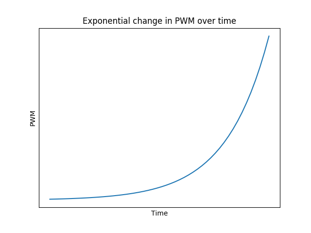
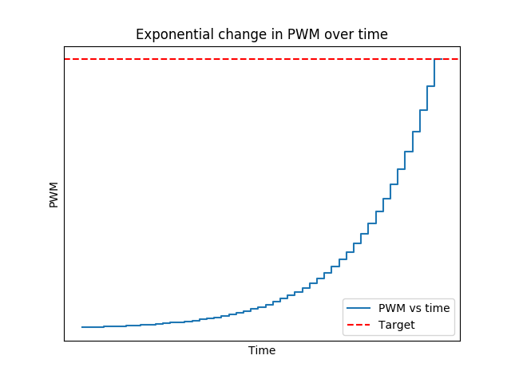

# Introduction

I began working on this code with the purpose of changing the speed of a motor or the 
brightness of LEDs exponentially.

The reason of wanting to change the PWM exponentially is due to using a keyboard to 
control an Arduino. With a keyboard there could be only be two states (on or off) when
pressing keys. However, I wanted to change the PWM as time passes while the key is pressed.
A linear change of PWM is good enough for changing the speed of a motor. Though, it is not 
enough for changing the brightness of the LEDs; it "does not feel right." I think that 
exponential change in PWM would better suited to change the brightness of LEDs since often 
I want to make small changes in the brightness of the LED if the key is pressed momentarily. 
But if the is key pressed longer I would like increase the PWM faster. That is, small rate of 
change at first and large rate of change as time passes.  

So I though about a graph that looked more or less like this:

# Ticks and targets

I used **targets** and **ticks** as means to achieve the desired exponential change in PWM.
When a key is pressed a **target** is set. For instance, if key 
*Q* is set to be the key that increases a LED's PWM then while this key is pressed, a 
**target** of 255 is set. Once there is a target different to the current PWM, a counter I 
call **tick** will be updated every certain amount of time. The PWM of the motor increases 
towards **target** every time the counter **tick** updates.

Using this method the graph of PWM vs time would look like this:

# Exponential formula used

    a*e^(b*x) + c

where **a**, **b**, **c** are constants used to change the graph of the exponential change
in PWM. 